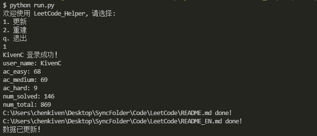
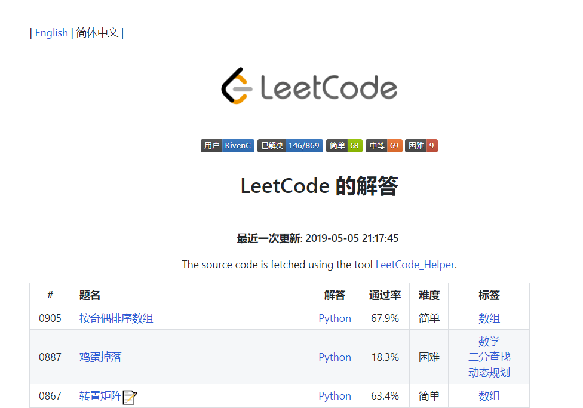
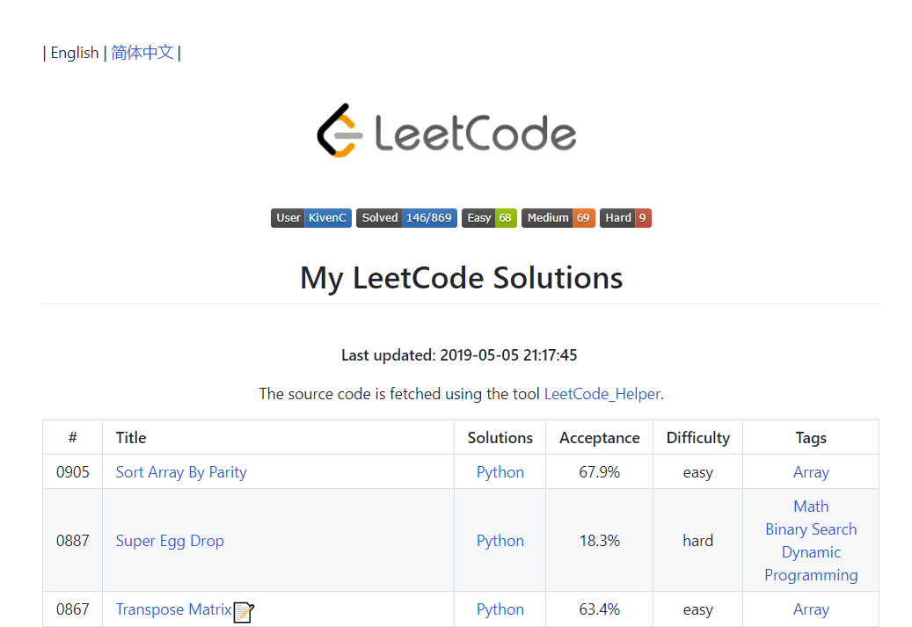
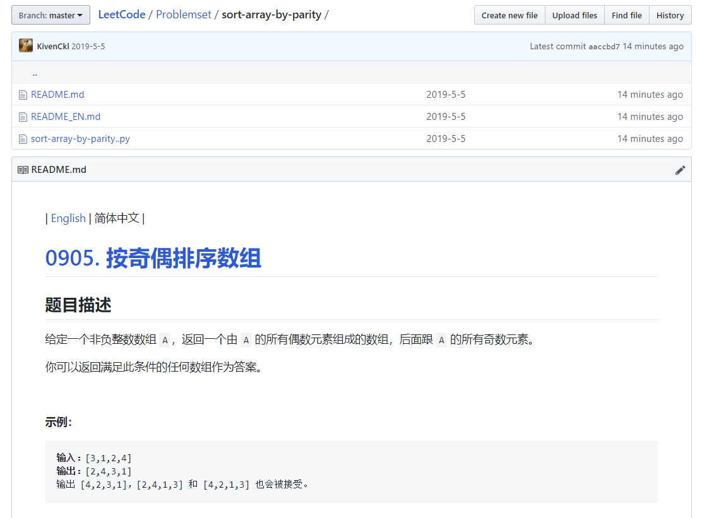

<!--
 * @Author: KivenChen
 * @Date: 2019-04-25
 * @LastEditTime: 2019-05-06
 -->
# LeetCode_Helper

## 概述

Python 实现的 LeetCode 仓库美化程序。爬取 LeetCode-cn AC 的题目描述和提交的代码，并整理至相应的文件夹，生成相应的 README 文件。

本项目参考了:

- [leetcode-spider](https://github.com/zhantong/leetcode-spider)
- [LeetCodeCrawler](https://github.com/ZhaoxiZhang/LeetCodeCrawler)

## 特点

- 支持爬取题目列表（中英文），保存为指定目录下的 README 和 README_EN 文件
- 支持爬取题目描述（中英文），保存为对应 title 文件夹下的 README 和 README_EN 文件
- 支持爬取用户提交的代码，保存为对应 title 文件夹下的 AC 源码（可以是任意语言）
- 支持修改导出数据的模板
- 异步下载题目描述，高速并发导出文件
- 支持增量更新，当 LeetCode-cn 有新内容（题目/提交的代码）时，可以选择增量形式更新

## 使用

使用 `git clone` 或直接下载本仓库代码至本地

本项目需要用到第三方库 `requests` 和 `aiohttp`，可通过 `pip` 命令安装。

运行 `python run.py`



## 效果

具体效果以及爬取的具体数据可参看我的 repo: [LeetCode](https://github.com/KivenCkl/LeetCode)







你可以根据你自己的需求爱好修改 `templates.py` 其中的模板

可以修改其根目录下的 `config.json` 文件:

``` json
{
    "username": "leetcode-cn@leetcode",
    "password": "leetcode",
    "outputDir": "../LeetCode",
    "timeInterval": 0.1
}
```

- `username` 和 `password` 对应你的 LeetCode-cn 账号和密码
- `outputDir` 对应你希望存放源码文件的目录
- `timeInterval` 为访问 LeetCode-cn 的时间间隔，默认为 0.1s
